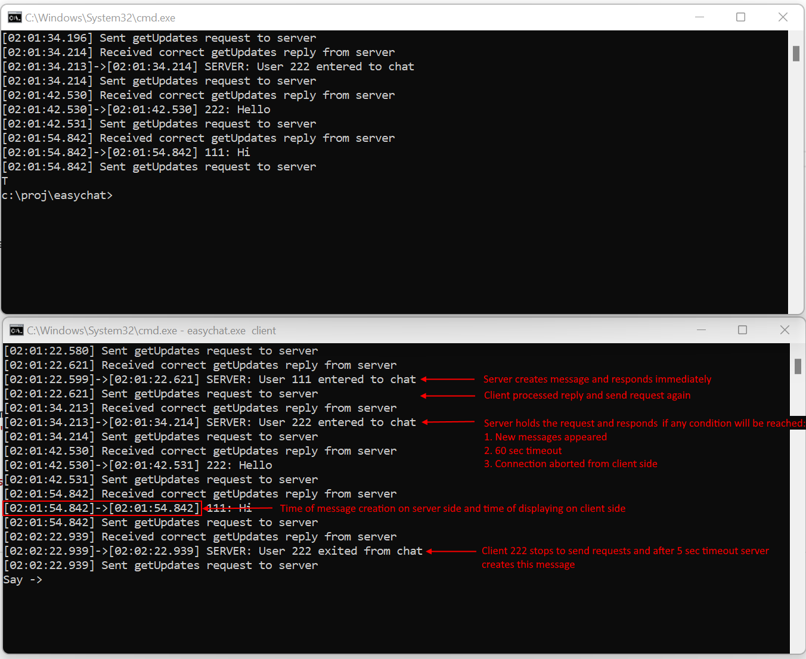

# easychat
Small client-server app demonstrates how to organize live chat without persistent connection. 
The benefits are
1. Number of server connections are NOT increases
2. Simple logic without connect/recconnection code
3. Server may be tested more easily

## How it works
1. Client sends getUpdates request, server sends reply if updates for this client found, otherwise it waits up to 60 sec. If updates appeared server returns it immediately
2. After getUpdate response client send request again. If client stops to send these requests, server assumes that client disconnected and removes user from chat. So, **server has only one active connection with client**



## Build and run
### Preconditions
Install go 1.19+.
Just download go installer for your platform [here](https://go.dev/dl/) and install.
Then open command prompt or bash and check go tools availability
```
$ go version
```
### Build
Clone the project, open command prompt or bash in root folder and run
```
$ go build
```
### Run
#### Server
```
$ ./easychat server
```
#### Client
```
$ ./easychat client
```
